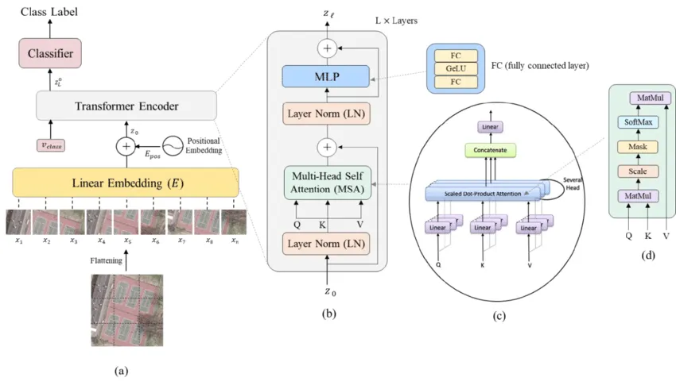

# VisionTransformerRepo
In this repository you will find Vision Transformer created from scratch based on <a href=https://www.researchgate.net/publication/348947034_Vision_Transformers_for_Remote_Sensing_Image_Classification>Bazi et. al. </a>
 

 
here is a discription on how to this model: 
<ol>
<li>step1: the idea is to reshape each n,c,h,w (batch size,channel,height,width)
		into n, n_patches*n_patches , (h*w*c) / (n_patches*n_patches). then we flatten each
		n_patch into a vector and apply a linear transformation to any embedding length 
 		we want (512) for example, to generate tokens. Finally, we are going to concatinate
 		the v-class token (classification token) to the previous tokens.</li>
<li>step2: second step is to add the positional encoding. The role of this vector 
		is to help the model to understand the position of each patch in the original image.
		those embeddings can be leared, but we can instead use sines and cosines waves. 
		In fact that is possible because, what positional vectors do is they add low frequency 
		low frequency values to the tokens at the beginning of the image and high frequency values
		for the tokens referring to the end of the image.(check Vaswani et. al. Attention is all
 		you need 2017).</li>
<li>step3: In this step we are going to build the most important part of the model, i.e. the Encoder Block
		the encoder block is composed of a normalization step the tokens of each image from the image batch
		is normalized to have 0 mean and 1 std. the second step is to add the Multi-head Attention, and finally
		have some residual connctions to be added. those residua connections will help the system to extend without
		having the problem of vanishing gradient. thus for this step we are going to add a new class for the 
		self attention. we build to classes one is a MultiHeadSelfAttention with loops and another implementation 
 		without loops. also we implement the Transformer Encoder block that is based on MHSA blocks. </li>
<li>step4: This is the final step where we ill add the Multi Layer Perceptron responsible for classification
		this is done by extracting the first classification token (v_class) from the tokens list we have
		and then apply a customized MLP based on the number of classes we have.</li>
</ol>
    
all the comments and the discription you will found in the code is extracted from this image:

